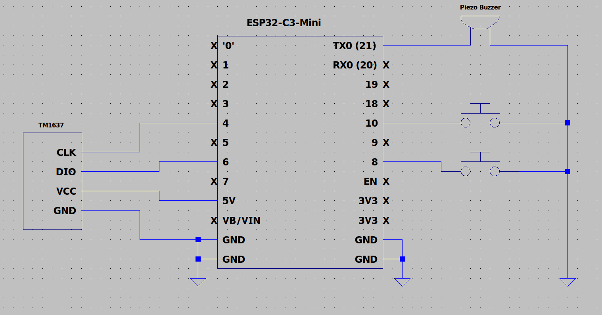

# Digital-StopWatch

#### This project was inspired from the IEEE Student Branch at UCI. This project consists of an ESP32, a Piezo Buzzer, two buttons and a TM1637 7-segment 4 digit display. This is a digital timer that starts from zero and counts up. One button starts and pauses, and the other button stops. If the stop button is pressed, then the start/pause button is pressed after, the timer resets. I have also created my own schematic in LTspice based off of the original schematic. Note that the Timer and TM1637 library are required.

#### Circuit Schematic:



## How to run
I ran this code on a WeAct Studio esp32c3 board.

If using the Arduino IDE, make sure the WeAct Studio esp32c3 board is the correct selected one and enable CDC on boot.

If running the script in CLI, it will prompt you for your board's serial port that it is connected to, so you need to find it and mention it. The serial port is usually /dev/ttyACM0 or /dev/ttyUSB0 but it could also be different. Also, if the shell script is not executable, chmod it.

If you prefer a manual/edited compilation and upload, either edit my shell script or simply copy them one at a time with custom flags, note that CDC on boot is required for the serial monitor to work.

Below is the easy script method in CLI.

### 1. Find Connected Serial Port
#### On Linux
```bash
ls /dev/tty*
```   

#### With Arduino CLI (recommended method)
```bash
arduino-cli board list
```

### 2. Run the program in CLI
```bash
./run.sh
```